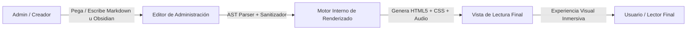
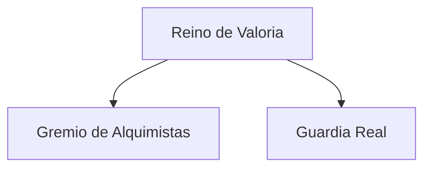

# ESPECIFICACIÓN TÉCNICA DEL MOTOR DE RENDERIZADO MARKDOWN (STORYTELLING & LECTURA INMERSIVA)

> [!IMPORTANT]
> **Separación de Roles de la Plataforma**:
> - **Herramienta de Escritura / Administración (Admin/Creador)**: Interfaz de creación donde el administrador escribe o pega contenido en Markdown puro, Obsidian Flavored Markdown, comentarios internos `%%` y atributos narrativos.
> - **Vista de Lectura Final (Usuario / Lector)**: Interfaz inmersiva procesada por el motor. El lector **NUNCA ve la sintaxis Markdown, ni códigos, ni comentarios de administración**. Solo experimenta la historia formateada con tipografía elegante, colores de personajes, audio y efectos visuales.
> - **Compatibilidad Instantánea**: Cualquier historia escrita previamente en **Obsidian** que sea copiada y pegada en el editor del Admin se traducirá e interpretará automáticamente sin requerir adaptaciones manuales.

---

## 1. Arquitectura del Motor y Roles del Sistema

### 1.1 Vista Administrador vs. Vista Lector Final



- **Editor Admin**:
  - Resaltado de sintaxis, vista de código fuente común, atajos de edición.
  - Visibilidad de comentarios ocultos `%% nota interna %%`, tags de organización `#capitulo/1`, referencias de bloque `^id` y atributos en texto plano.
- **Vista Lector Final (End User)**:
  - Renderiza componentes semánticos cinemáticos.
  - Elimina automáticamente la sintaxis de marcado (`**`, `[[`, `]]`, `{...}`, `%%`).
  - Oculta notas de producción, metadatos internos y comentarios del creador.

---

## 2. Traductibilidad Nativa de Obsidian (Copy-Paste Directo)

El motor procesa el **100% de las reglas de Obsidian Flavored Markdown (OFM)** al ser copiadas directamente desde una bóveda (vault) existente:

### 2.1 Enlaces Internos y Wikilinks
- `[[Tres leyes de la física]]` → Renderiza como enlace interno limpio o salto de capítulo en la lectura: `<a class="story-link">Tres leyes de la física</a>`.
- `[[Tres leyes|Leyes físicas]]` → Interpreta el alias para el lector mostrando solo "Leyes físicas".

### 2.2 Incrustaciones Internas y Archivos (Embeds)
- `![[Engelbart.jpg]]` → Se traduce a imagen del sistema: ``.
- `![[Engelbart.jpg|640x480]]` o `![[Engelbart.jpg|300]]` → Respeta dimensiones exactas de ancho y alto.
- `![[Capitulo1#Escena2]]` → Incrusta directamente la sección indicada para el lector.
- `![[Capitulo1#^bloque-lore]]` → Incrusta un bloque específico por su ID.

### 2.3 Referencias de Bloque (`^id`)
- Definición en Admin: `Este es un pasaje antiguo. ^pasaje-01`
- **Comportamiento en Lectura Final**: El token `^pasaje-01` es invisible para el lector final, pero el motor asigna un `id="pasaje-01"` al párrafo para permitir navegación, marcadores de lectura y citas.

### 2.4 Comentarios Internos del Creador (`%%`)
- Sintaxis Admin: `La protagonista descubre la verdad aquí. %% REVISAR: Agregar más tensión en el capítulo 2 %%`
- **Comportamiento en Lectura Final**: Todo lo encerrado en `%% ... %%` es **completamente omitido** en el renderizado del usuario final.

### 2.5 Destacados y Callouts Nativo de Obsidian
- `==Texto resaltado==` → Convertido a `<mark class="story-highlight">Texto resaltado</mark>`.
- Bloques de cita estilo Obsidian (`> [!note]`, `> [!warning]`, `> [!quote]`, etc.) se transforman automáticamente en componentes visuales de UI para la lectura.

---

## 3. Formato de Texto Básico y Párrafos

### 3.1 Párrafos y Salto de Línea
- **Párrafos**: Separados por una línea en blanco (`\n\n`). En la lectura final se envuelven en `<p class="story-paragraph">`.
- **Salto de Línea Intrapárrafo**:
  - Dos espacios al final de línea `  ` + `Enter`.
  - Sintaxis HTML `<br>`.
  - *Regla de Estrictez*: Un solo salto de línea sin espacios en el editor admin se une en una frase continua en la lectura final para mantener el flujo narrativo prolijo.

### 3.2 Tabla de Enfatizado y Sintaxis

| Estilo | Sintaxis Markdown / Obsidian | Salida en Lectura Final (Usuario) | Uso Narrativo |
| :--- | :--- | :--- | :--- |
| **Negrita** | `**texto**` o `__texto__` | `<strong class="story-bold">` | Énfasis dramático, fuerza, tono alto. |
| *Cursiva* | `*texto*` o `_texto_` | `<em class="story-italic">` | Pensamientos internos, énfasis tonal, idiomas ajenos. |
| ***Negrita + Cursiva*** | `***texto***` | `<strong><em>` | Clímax, gritos, revelaciones fundamentales. |
| ~~Tachado~~ | `~~texto~~` | `<del class="story-strike">` | Memorias borradas, censura, texto tachado. |
| ==Resaltado== | `==texto==` | `<mark class="story-highlight">` | Pistas, objetos inspeccionados, palabras de poder. |
| <u>Subrayado</u> | `<u>texto</u>` o `++texto++` | `<u class="story-underline">` | Decretos, cartas oficiales, firmas solemnes. |
| Exponente | `x^2` o `texto^sup^` | `<sup>` | Notas mágicas, referencias numéricas de grimorio. |
| Subíndice | `H~2~O` o `texto~sub~` | `<sub>` | Fórmulas alquímicas, química/tecnología. |

---

## 4. Tipografía y Sistema de Fuentes Narrativas (Admin Extensions)

El administrador puede aplicar estilos tipográficos sin romper el estándar de lectura.

### 4.1 Sintaxis de Fuentes para el Admin
1. **Atributo Inline / Bloque**: `{font: nombre_fuente}`
2. **Etiqueta HTML**: `<font name="handwriting">Texto</font>` o `<span font="serif">Texto</span>`

### 4.2 Catálogo de Fuentes Narrativas

```markdown
<!-- Tipografía Estándar de Novela -->
{font: serif} Este es el texto estándar de lectura narrativa (Garamond / Georgia).

<!-- Tipografía Cinemática / UI Sci-Fi -->
{font: sans} Este texto se utiliza para interfaces, pantallas cibernéticas o narración moderna.

<!-- Tipografía de Carta Escrita a Mano -->
{font: handwriting} Querido diario: hoy cruzamos el bosque de las sombras...

<!-- Tipografía Monospaciada / Terminal -->
{font: mono} > LOG_SISTEMA: Conexión neuronal establecida a las 03:00 hrs.

<!-- Tipografía Mística / Fantasía -->
{font: fantasy} El antiguo pergamino contenía inscripciones en una lengua olvidada...
```

### 4.3 Tamaños Tonométricos de Texto
- **Susurro / Voz Baja**: `~susurro~` o `{size: small}` → Muestra texto en tamaño reducido y opacidad tenue.
- **Voz Normal**: Texto base.
- **Voz Elevada**: `{size: large}` → Aumenta el peso visual de la tipografía.
- **Grito / Impacto**: `{size: xl}` o `# Grito` → Texto en gran formato para momentos de clímax.

---

## 5. Sistema de Colores de Texto y Fondo (Text Colors)

Permite asignar esquemas cromáticos a los diálogos, magia, facciones y alertas.

### 5.1 Sintaxis para el Admin
1. `[Texto a colorear]{color: #HEX}` o `[Texto a colorear]{color: nombre_color}`
2. `<color name="crimson">Texto en rojo carmesí</color>`
3. `<span style="color: #ff4500;">Fuego ancestral</span>`

### 5.2 Paleta Narrativa de Colores Estándar

| Token de Color | Sintaxis Admin | Código CSS | Significado en Lectura (Usuario) |
| :--- | :--- | :--- | :--- |
| `primary` | `[Texto]{color: primary}` | `#e0e0e0` | Color base del texto narrativo. |
| `hero` / `gold` | `[Triunfo]{color: gold}` | `#ffd700` | Voces divinas, héroe principal, tesoros, gloria. |
| `danger` / `blood` | `[Peligro]{color: blood}` | `#dc143c` | Sangre, ataque enemigo, daño recibido, peligro. |
| `magic` / `arcane` | `[Hechizo]{color: arcane}` | `#9370db` | Magia arcana, portales, energía astral. |
| `poison` / `nature` | `[Veneno]{color: poison}` | `#32cd32` | Toxinas, naturaleza, magia ácida. |
| `ice` / `mana` | `[Escarcha]{color: ice}` | `#00bfff` | Hielo, maná cristalino, tecnología fría. |
| `shadow` / `dark` | `[Sombra]{color: shadow}` | `#4a4a4a` | Entidades oscuras, secretos, texto tenue. |
| `holy` / `light` | `[Bendición]{color: light}` | `#fff8dc` | Magia de curación, luz celestial, pureza. |

### 5.3 Efectos Especiales de Texto
- **Brillo Místico / Neón**: `[Texto resplandeciente]{glow: cyan}`
- **Temblor (Miedo / Terremoto)**: `[¡El suelo se derrumba!]{effect: shake}`
- **Texto Fantasmagórico**: `[Presencia etérea...]{effect: fade}`

---

## 6. Encabezados y Transiciones Cinemáticas

```markdown
# Título General de la Obra (H1)
## Acto I: Las Sombras del Pasado (H2)
### Capítulo 1: El Regreso a Casa (H3)
#### Escena 1: La Llegada al Puerto (H4)
```

### Separadores de Escena (Cortes Cinemáticos)
```markdown
***  <!-- Corte de escena limpio -->
---  <!-- Transición de tiempo o cambio de ubicación principal -->
___  <!-- Transición temática profunda / Cambio de POV -->
```

---

## 7. Bloques Narrativos y Diálogos de Personajes

### 7.1 Reconocimiento Automático de Diálogos
Copiado directo de guiones o historias estándar:

```markdown
**Elena:** "Debemos cruzar el valle antes de que se ponga el sol."

**Marcus:** *[Ajustando el broche de su capa]* "Los caminos principales están custodiados."
```
*En Lectura Final*: El motor renderiza globos/tarjetas de diálogo estilizadas con los nombres resaltados y avatares asignados al personaje.

### 7.2 Componente Avanzado `<speech>` (Admin)
```markdown
<speech speaker="Elena" avatar="portraits/elena.png" side="left" color="#e74c3c">
—No permitiré que este pueblo sufra el mismo destino que nuestra patria.
</speech>
```

### 7.3 Callouts Narrativos y Cajas de Lore
```markdown
> [!note] Nota del Cronista
> La Gran Guerra de los Cristales concluyó en el año 512.

> [!thought] Monólogo Interno (Elena)
> *¿Y si estamos caminando directamente hacia una trampa?*

> [!lore] Códice: El Anillo de la Tormenta
> Artefacto forjado en la cumbre del Monte Trueno. Otorga +5 a la resistencia eléctrica.

> [!warning] Alerta de Emboscada
> Escuchas el crujido de hojas secas a tus espaldas.
```

---

## 8. Multimedia, Iluminación y Audio de Ambiente

### 8.1 Ilustraciones e Imágenes
```markdown


```

### 8.2 Disparadores de Audio Sincronizados
```markdown
::audio-bgm[src="audio/bgm_taberna.mp3" loop="true" volume="0.4"]
::audio-sfx[src="audio/sfx_trueno.mp3" trigger="on-scroll"]
```

---

## 9. Elementos Interactivos (CYOA) y Fichas

### 9.1 Toma de Decisiones
```markdown
### ¿Qué camino decides tomar?

- [ ] [Avanzar en silencio por las sombras del callejón](#opcion-sigilo)
- [ ] [Desenvainar la espada y encarar a los guardias](#opcion-combate)
```

### 9.2 Fichas de Personaje y Diagramas
```markdown
| Atributo | Valor | Estado |
| :--- | :---: | :---: |
| **Fuerza** | 16 | Normal |
| **Puntos de Vida** | 42/50 | Herido leve |
```



---

## 10. Metadatos del Capítulo (YAML Frontmatter)

Configuración que el Admin coloca al inicio del archivo `.md` para personalizar el comportamiento del capítulo en la lectura final:

```yaml
---
title: "Capítulo 1: El Regreso a Casa"
author: "Tu Nombre"
chapter_number: 1
bgm: "audio/bgm_capitulo1.mp3"
ambient_light: "#12121a"
default_font: "serif"
reading_time_minutes: 8
tags:
  - capitulo/1
  - estado/noche
---
```

---

## 11. Resumen de Reglas del Parser Interno para Desarrolladores

1. **Invisibilidad del Marcado para el Lector**: El usuario final jamás observa corchetes, hashtags, etiquetas HTML de formato o comandos de audio en texto plano.
2. **Cero Fricción al Copiar de Obsidian**: Cualquier nota `.md` proveniente de Obsidian se renderiza correctamente de inmediato. Los comentarios `%%` son ignorados en lectura final, los `[[Wikilinks]]` se procesan limpiamente y los Callouts `> [!]` se estilizan automáticamente.
3. **Inyección de Estilos en Tiempo de Ejecución**: El motor convierte los atributos en clases CSS y elementos HTML5 nativos con variables dinámicas de tema.