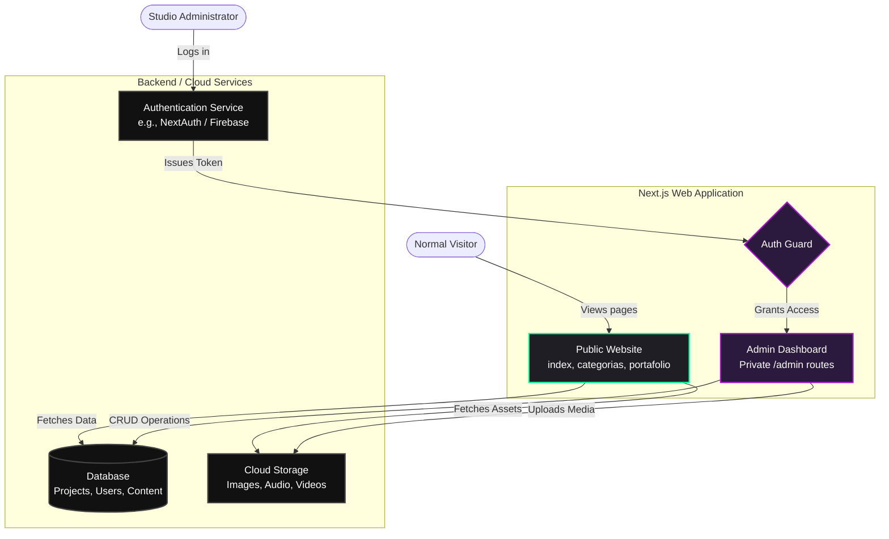

# Wiener Hound Studios (WHS) - Upgrade Roadmap & System Architecture

This document provides a detailed analysis of the current website files and proposes a professional roadmap to upgrade the design, architecture, and features, including a dynamic Admin panel for content management.

---

## 1. Current Codebase Analysis

Here is exactly what each of the current core files does:

### `index.html`
- **Purpose:** The main landing page of the studio.
- **Features:** 
  - **Header & Navigation:** Includes a responsive hamburger menu and a logo that plays an Easter egg audio track (`musica-fondo.mp3`) when clicked.
  - **Hero Section:** A visually striking introduction with a neon-underlined title.
  - **Services:** Static grid displaying "Creación de Manga", "Producción de Anime", etc.
  - **Video:** An embedded YouTube iframe showcasing a studio reel.
  - **Portfolio:** A grid intended to show projects (has a script to fetch from `portafolio.json`).
  - **Testimonials & Team:** Hardcoded sections showing reviews and team members (Wiener).
  - **Contact & Footer:** A functional form using Formspree (`https://formspree.io/f/mzzawwyb`), social links, and links that trigger a modal for Privacy Policy and Terms of Service.
  - **Scripts:** Contains inline JavaScript to handle the mobile menu toggle, the modal popup logic, the audio playback on the logo, and a `fetch` request for the portfolio.

### `categorias.html`
- **Purpose:** A dedicated page to showcase projects categorized by medium (Manga, Anime, Visual Novel).
- **Features:**
  - **Structure:** Divided into three main sections: `#manga`, `#anime`, `#visual-novel`.
  - **Featured Projects:** Highlights a main project (e.g., *Umbral*, *Código Estelar*, *The Veil*) with tags indicating status (e.g., "En Emisión") and genre.
  - **Project Grids:** Smaller cards for Work In Progress (WIP) or secondary projects.
  - **Shared Components:** Reuses the header, footer, modal logic, and audio Easter egg script from `index.html`. It also includes a Giscus script for comments via GitHub discussions.

### `style.css`
- **Purpose:** The global stylesheet that dictates the visual identity of the site.
- **Design System:** 
  - **Color Palette:** Uses a dark theme (`--bg-dark-primary: #121212`) with bold accent colors: Purple (`#a914ce`) and Neon Green (`#00ff99`).
  - **Typography:** Uses Google Fonts' `Poppins` for a modern, rounded sans-serif look.
  - **Effects:** Heavy use of `box-shadow` to create neon "glow" effects (`--glow-shadow-purple`, `--glow-shadow-green`) and `backdrop-filter: blur()` for a glassmorphism effect on the sticky header and modal.
  - **Responsiveness:** Utilizes CSS Grid and Flexbox, with media queries (`@media`) that adjust font sizes, convert the navigation to a dropdown menu, and stack elements vertically on mobile devices.

---

## 2. Professional Upgrade Roadmap

While the current site has a strong aesthetic foundation, it relies heavily on static HTML and inline JavaScript, making it hard to scale and maintain. The design can also be refined to look more like a premium, industry-leading studio.

### A. Design & Color Theory Upgrades
- **Refined Color Palette:** Keep the dark theme but soften the neon colors to make them look more elegant. Transition to a deep, rich dark background (e.g., `#0A0A0B`) with subtle, sophisticated gradients rather than harsh solid neon glows.
- **Typography:** Pair `Poppins` (for headings) with a highly readable serif or geometric sans-serif for body text (like `Inter` or `Roboto`) to improve readability and professionalism.
- **Modern Effects:** 
  - **Scroll Animations:** Implement libraries like **GSAP** or **Framer Motion** so elements smoothly fade or slide in as the user scrolls.
  - **Parallax:** Add subtle parallax effects to the hero image and category headers.
  - **Micro-interactions:** Add magnetic button hover effects and custom cursors to make the site feel "alive" and highly interactive.

### B. Technical Architecture Upgrade (From Static to Dynamic)
Currently, to add a new Manga or edit a team member, you have to open the HTML file and edit the code. The new roadmap shifts the project to a **Fullstack Web Application**.

- **Frontend:** Transition to **Next.js (React)** or **Nuxt.js (Vue)**. This allows for reusable components (Header, Footer, ProjectCard) so you don't repeat code across pages.
- **Styling:** Use **Tailwind CSS** for rapid, consistent, and highly maintainable styling.
- **Backend / Database:** Use **Supabase** or **Firebase** to store project data, images, and user accounts.

### C. Project Scope: Admin Panel & CMS Module
A secure, private module strictly for the site administrators. 

- **Authentication:** A secure login page (`/admin/login`). Only authorized users (Admins) can access the dashboard.
- **Content Management System (CMS):**
  - **Portfolio Manager:** A visual interface to upload new project images, write descriptions, add tags (e.g., "Manga", "Sci-Fi"), and publish them directly to the website without touching code.
  - **Category Editor:** Edit the "Featured Project" for Anime, Manga, or Visual Novels dynamically.
  - **Team & Testimonials:** Add or remove team members and client reviews from the dashboard.
- **Security:** API routes will be protected. Normal visitors will only fetch data (read-only), while Admins will have Create, Update, and Delete (CRUD) permissions.

---

## 3. New System Architecture (Mermaid Diagram)

Below is the visual representation of the upgraded architecture, showing the separation between the Public Website (what visitors see) and the Admin Dashboard (what you see).

### Next Steps for Implementation:
1. **Design Phase:** Create a Figma mockup of the new refined UI and the Admin Dashboard.
2. **Setup Repository:** Initialize a Next.js project with Tailwind CSS.
3. **Database Schema:** Define the tables in Supabase for `Projects`, `Categories`, and `Team`.
4. **Develop Admin Panel:** Build the secure login and the forms to upload content.
5. **Develop Frontend:** Build the public-facing site to pull data dynamically from the database instead of hardcoded HTML.

---

## 4. Current Implementation Status (Completed Phase 1)

As of today, the **Design & Color Theory Upgrades** and **Modern Effects** have been fully applied to the existing static website to instantly achieve a premium, professional studio look.

### Changes Made in Phase 1:
- **Refined Color Palette (`style.css`):**
  - Shifted the background to a deeper, richer `Premium Rich Dark` (`#0a0a0b`).
  - Softened the harsh neon accents into a refined `Purple` (`#9d2ec5`) and `Neon Green` (`#00e68a`).
  - Implemented subtle gradients on text (e.g., the `<h2>` tags) and buttons for a modern 3D depth effect.
- **Typography Upgrade (`index.html`, `categorias.html`, `style.css`):**
  - Integrated `Inter` as the primary body font for improved readability and a clean, tech-forward aesthetic.
  - Kept `Poppins` for headings but adjusted the font weights and letter spacing (`-0.02em`) to make titles look bolder and more cohesive.
- **Micro-interactions & UX:**
  - Upgraded all button hover states with cubic-bezier transitions, scaling effects, and magnetic-like shadows.
  - Refined the glassmorphism header (`backdrop-filter: blur(16px)`) to blend seamlessly with the new dark background.
  - The studio logo now scales and tilts slightly upon hover for a more interactive feel.
- **Scroll Animations (`GSAP` integration):**
  - Added the GSAP (GreenSock Animation Platform) and ScrollTrigger CDN to both HTML files.
  - Created a global `.fade-up` utility class.
  - As the user scrolls, each section (Services, Video, Portfolio, Testimonials, Categories) dynamically fades in and slides up, creating a cinematic storytelling experience.
  - The hero sections now have a cascading entrance animation on load.

---

## 5. Current Implementation Status (Phase 2 Component Migration)

We have advanced into the technical architecture upgrade. The static HTML is now fully migrated into a modern **Next.js 15 App Router** project. 

### Changes Made in Phase 2 Setup & Migration:
- **Next.js Project Initialization:** Scaffolded `whs-frontend` with TypeScript, Tailwind CSS, and ESLint.
- **Asset Migration:** Moved all `images/` and `audio/` to the Next.js `public/` directory.
- **Component Breakdown:**
  - Designed reusable `<Navbar />` with state management for the mobile menu and Easter egg audio player.
  - Designed reusable `<Footer />`.
- **Page Translation (HTML to React):**
  - **`index.html` → `app/page.tsx`:** Successfully migrated the landing page with full fidelity, leveraging Tailwind utility classes mapped from the custom CSS and integrating GSAP for scroll animations.
  - **`categorias.html` → `app/categorias/page.tsx`:** Fully converted the categories page, making use of Next.js `<Image />` component for automatic optimization of cover art.

---

## 6. Current Implementation Status (Started Phase 3: Backend & CMS)

With the frontend framework solidly in place and the UI migrated, we have begun setting up the backend data architecture.

### Changes Made in Phase 3 Setup:
- **Supabase Integration:** Installed `@supabase/supabase-js` into the project to handle our database and authentication.
- **Client Configuration:** Created `src/lib/supabase.ts` to initialize the database connection across the entire application.
- **Admin Module Scaffold:** Developed the structural foundation for the CMS at `src/app/admin/page.tsx` with a premium, secure login interface matching the studio's new aesthetic.

---

## 7. What's Next? (Database Implementation)

To bring the Admin Module to life, manual configuration on the Supabase platform is required by the Studio Administrator.

1. **Supabase Configuration (Completed):**
   - The `Project URL` and `Anon API Key` have been successfully injected into the local `.env.local` file inside `whs-frontend`.
2. **Schema Creation (Completed):**
   - Executed SQL query in Supabase to create the `projects` table securely.
3. **Authentication Hooks (Completed):**
   - Integrated `@supabase/ssr` to securely handle user sessions.
   - Built the `middleware.ts` to strictly protect the `/admin/dashboard` route.
   - Admin Login form is fully functional.
4. **Dynamic Content Rendering & CMS (Completed):**
   - Built the complete Admin Dashboard where you can view your current projects.
   - Created the `/admin/dashboard/nuevo` page allowing the Admin to insert new Manga, Anime, or Visual Novels with Cover Image uploads into a Supabase Storage bucket (`whs-media`).
   - Upgraded both the `app/page.tsx` (Portafolio section) and `app/categorias/page.tsx` to automatically pull and display projects directly from the Supabase PostgreSQL database instead of static HTML.

---

## 8. Final Steps to Go Live
1. **Create Storage Bucket:** In your Supabase dashboard, go to Storage and create a new public bucket named exactly **`whs-media`**. This is where your image uploads will go.
2. **Deploy to Vercel:** Link the GitHub repository to Vercel for free, automatic hosting. Be sure to add the Supabase URL and Keys into the Vercel Environment Variables.